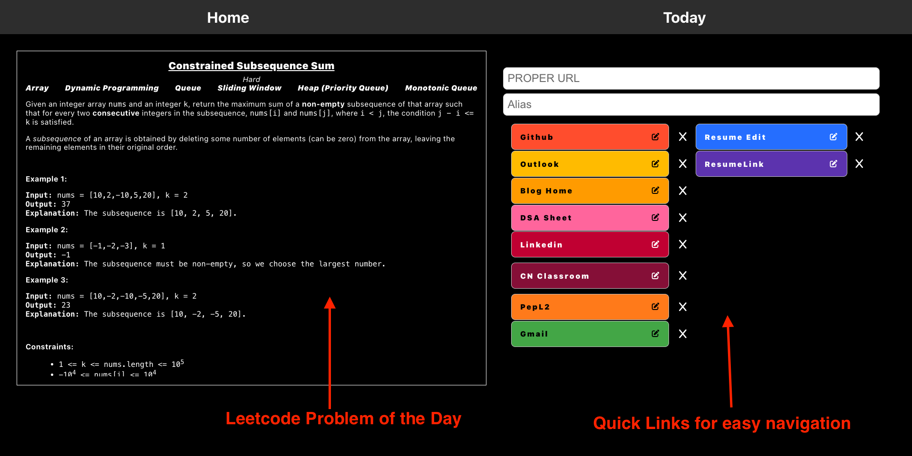
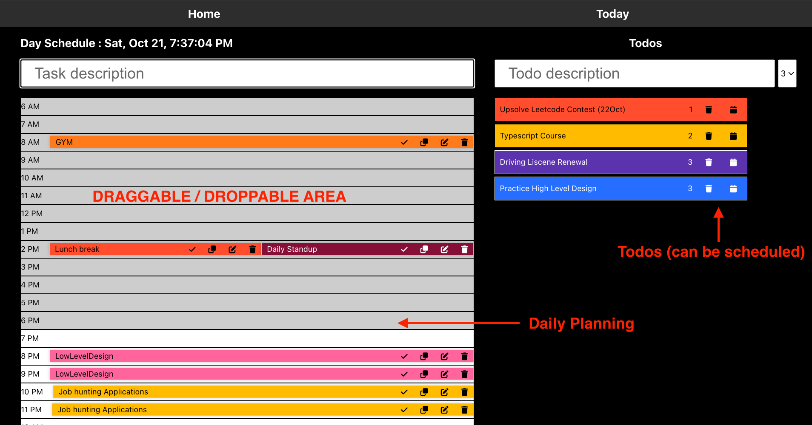

# Atomic Habit Chrome Extension
## DEMO LINK
- https://paras-kaushik.github.io/leetcode-habit/
## Introduction
The Atomic Habit Chrome Extension is a powerful tool designed to help you build positive daily routines and improve your productivity. It draws inspiration from the book "Atomic Habits" by James Clear, which explores the concept of habit formation and provides actionable insights on behavior change. This extension is built around the principles of habit-building discussed in the book. In addition, it incorporates the practice of timeboxing, a technique favored by numerous successful individuals, to enhance your daily routine.
## Features
1. **Problem of the Day**: This extension fetches the "Problem of the Day" and displays it on your new tab page, serving as your cue to initiate your daily habits.
2. **Quick Links**: The app has quick links which can be used for speedy navigation

3. **Daily Scheduler**: The second tab of this extension provides a daily scheduler, helping you implement the laws of habit-building and timeboxing by allocating time for tasks and rewarding your progress.
4. **Todos Manager**: A central Place to manage all your todos

## The Laws of Habit Building
James Clear identifies several fundamental laws for building and maintaining habits:

1. **Make it Obvious**: This extension provides a clear cue by displaying the "Problem of the Day" on your new tab, making your daily habit-building obvious and easy to start.

2. **Make it Attractive**: The "Problem of the Day" serves as an attractive and inspiring cue, creating a craving for self-improvement.

3. **Make it Easy**: The daily scheduler within the extension simplifies the process of allocating time for tasks and habits, making it easier to build and maintain them.

4. **Make it Satisfying**: As you complete tasks within the daily scheduler, you'll find a sense of satisfaction and reward, reinforcing your habit-building.

## Timeboxing and Its Advantages
Timeboxing is a time management technique where you allocate specific blocks of time to tasks or activities. This method is favored by many successful individuals, including Elon Musk, Bill Gates, and Pomodoro Technique creator Francesco Cirillo, for several reasons:

- **Enhanced Productivity**: Timeboxing encourages focus and prevents procrastination, leading to increased productivity.

- **Improved Time Management**: It helps you prioritize tasks and allocate time efficiently, ensuring that important activities are not neglected.

- **Reduced Stress**: By breaking tasks into manageable time blocks, timeboxing reduces stress and prevents burnout.

- **Accountability**: It holds you accountable for the tasks you set out to accomplish within a specified time frame.

## Installation
To use this extension, follow these steps:

1. **Build the Extension**
   - Run `npm i` to install all dependencies.
   - Run `npm run build` to create the build folder.

2. **Load the Extension**
   - Open the Chrome Extensions page.
   - Enable Developer Mode.
   - Click on "Load unpacked" and select the build folder generated in the previous step.

Now, you're all set to benefit from the Atomic Habit Chrome Extension, boost your daily productivity, and leverage the principles of "Atomic Habits" and the advantages of timeboxing.

## Usage
1. Upon opening a new tab, you'll see the "Problem of the Day" displayed, which serves as your cue to initiate your daily habits.

2. Switch to the second tab to access the daily scheduler. Use it to allocate time for tasks, practice timeboxing, and align your habits with the laws of habit-building.

## Contribution
If you'd like to contribute to this project or report issues, feel free to create a pull request or open an issue on the GitHub repository.

## License
This project is under the MIT License.

## About
This Chrome extension was created by Paras Kaushik. You can reach out to me at paraskaushik12@gmail.com for any questions or feedback.
